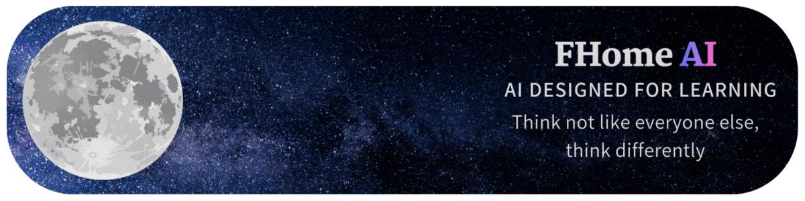

---

# FHome AI® – Education AI  
A modern, open-source web assistant built to demonstrate how AI interfaces work under the hood — ideal for students, teachers, schools, and anyone curious about building their own AI-powered chat system.

> This project is part of the Sliz® ecosystem and was created to help beginners understand the mechanisms behind conversational AI, UI logic, and browser-based local data storage.

---

## 🚀 Features

### **🌱 Beginner-friendly AI Interface**
A clean, responsive chat UI that mimics modern AI assistants — messages, avatars, typing animations, etc.

### **🧠 Works with Google Gemini API**
Uses `gemini-2.0-flash:generateContent` to provide real-time responses.  
Your prompts are wrapped with a custom instructional system for fine-tuned output behavior.

### **🧩 Local Chat History**
Conversations are saved inside browser cookies — no backend needed.

### **🎨 Customization Tools**
Inside the built-in settings modal, users can:
- Change display name  
- Set a custom avatar  
- Adjust message border radius  
- See live avatar preview  

### **📱 Fully Responsive**
Smooth mobile experience with slide-in sidebar and adaptive layout.

### **🪄 Typing Animation**
You get a modern typing indicator for AI messages — extra ✨ vibes.

---

## 📸 Screenshots

(Insert your screenshots here, e.g. interface.png, settings.png)

---

## 🛠️ Tech Stack

| Layer | Technology |
|-------|------------|
| Frontend | **HTML5**, **CSS3**, **JavaScript (Vanilla)** |
| AI Backend | **Google Gemini API** |
| Storage | **Cookies** |
| Icons | SVG / PNG |
| Compatibility | Chrome, Firefox, Safari, Mobile browsers |

---

## ⚙️ How It Works

### **1. UI Rendering**
The structure is split into:
- Sidebar (chat list, new chat button, settings)
- Main area (messages)
- Modal window (settings)
- Input area (message field + send button)

All elements are dynamically updated with `renderChats()` and `renderMessages()`.

### **2. Chat Handling**
Chats are stored as objects:

```js
{
  id: 12345678,
  title: "New Chat",
  messages: [
    { role: "user", content: "Hello!" },
    { role: "ai", content: "Hi there!" }
  ],
  createdAt: "2024-01-01T00:00:00Z"
}
````

### **3. Saving to Cookies**

Each update triggers:

```js
setCookie('fhomeai_data', JSON.stringify({chats, settings}), 365);
```

This makes the project **fully local and privacy-friendly**.

### **4. AI Request Flow**

When user sends a message:

1. It's added to chat history
2. Visual typing indicator appears
3. All previous messages are assembled into the Gemini request format
4. The user message is wrapped in a custom instruction block
5. API returns the answer
6. AI response is appended to chat

---

## 📡 API Requirements

You need a **Google AI Studio API key**:
[https://aistudio.google.com](https://aistudio.google.com)

Update the key:

```js
const API_KEY = "YOUR_API_KEY_HERE";
```

---

## 🧪 Running Locally

1. Clone the repo:

   ```sh
   git clone https://github.com/SlizR/FHome_AI.git
   ```
2. Enter the directory:

   ```sh
   cd FHome_AI
   ```
3. Open `index.html` in a browser.
   That’s it — no backend, no dependencies.
   It’s 100% client-side.

If you want local hosting:

```sh
npx serve
```

---

## 🧬 File Structure

```
/
├── index.html        # main app file
├── icon.png          # project icon
├── README.md         # documentation
└── LICENSE           # Apache 2.0 license
```

---

## 🛠️ Customization

### **Change Colors**

All main UI gradients live in CSS:

```css
background: linear-gradient(135deg, #0a4d3c, #1a7a5e);
```

### **Modify Assistant Personality**

Edit the `getSystemInstruction()` function:

```js
function getSystemInstruction(userMessage) {
  return `
    ...instructions...
    Please answer the following message: ${userMessage}
  `.trim();
}
```

### **Replace AI Model**

Change the endpoint:

```js
const API_URL = "https://generativelanguage.googleapis.com/v1beta/models/another-model:generateContent";
```

---

## 🧩 Known Limitations

* Cookies can store limited data (roughly 3–4 MB)
* No streaming support — responses appear after full generation

---

## 🗺️ Roadmap

* [ ] Switch cookies → IndexedDB
* [ ] Add real-time streaming
* [ ] Add dark/light theme toggle
* [ ] Add custom model selection menu
* [ ] Cloud sync for chats

---

## 🏛️ License – Apache License 2.0

This project is licensed under the **Apache License 2.0**.

### Required attribution:

* **Original author:** Sliz®
* **First public version:** Mavox-ID (**Creator Sliz®**)

Full license is available in the `LICENSE` file.

---

## 💡 Final Notes

**FHome AI®** was built to teach — not to replace industrial AI tools — and shows how surprisingly small and understandable an AI chat interface can be.

If you use or modify it, just keep the attribution lines (as required by the **Apache 2.0 license**) and enjoy building cool things 🚀 (Latest stable version: **933.stable, By the way, we've added our own help section to the settings and fixed some bugs.**)
